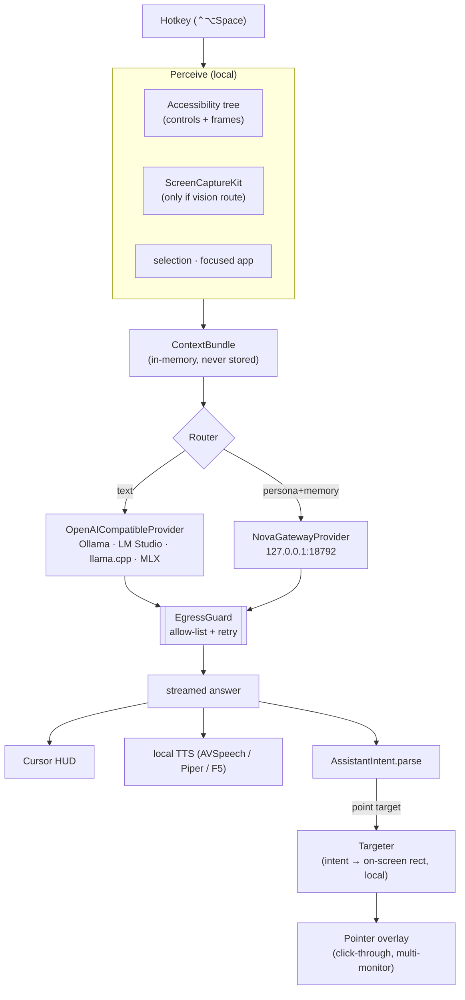

# Lodestar

**A local-only AI companion that lives next to your mouse cursor on macOS.** Hit a
hotkey and a small bubble appears at your pointer: it reads what's on your screen,
answers out loud, and can physically point at the control you're looking for — all
driven by *your own* models on your machine or LAN. Lodestar itself **never talks to the
public internet** — only to endpoints you run.

---

## Where this came from, and what it's for

Lodestar is an independent, **local-only reimagining of [Clicky](https://www.producthunt.com/products/clicky-2)**
— the delightful "AI buddy that lives next to your cursor on Mac"
([XDA writeup](https://www.xda-developers.com/someone-built-tiny-ai-that-lives-next-to-your-cursor-the-most-useful-thing-ive-tried-this-year/),
[clickyhq.com](https://www.clickyhq.com/)). Full credit to Clicky's creator for the idea
and the interaction design; the cursor-adjacent, screen-aware, *points-at-things* UX is
theirs.

The one thing Lodestar changes is the thing that matters most for a tool that watches your
screen and listens to your mic: **where your data goes.** Clicky is powered by cloud
services (Claude, AssemblyAI, ElevenLabs), so your screen and voice leave your machine.
Lodestar is built the other way around.

### Goals (the non-negotiables)

1. **Local-network-only, enforced — not promised.** Every network request passes through a
   single egress chokepoint that permits loopback, private-LAN addresses (RFC1918 / `.local`),
   and hosts you name — and denies the public internet outright. So screen and audio can only
   reach a model on your own machine or LAN. (Flip `allow_private_network: false` for
   loopback-only "strictly local" mode.)
2. **Provider-agnostic, including Nova.** Lodestar ships no model. Text, vision, speech-to-
   text and text-to-speech are each a swappable capability. Ollama, LM Studio, llama.cpp,
   vLLM, MLX, and the **Nova Gateway** are all first-class behind one small interface.
3. **Native and small.** Swift + system frameworks, zero external dependencies, so it
   builds offline and stays auditable.
4. **Privacy by construction.** Secure-field redaction before any screenshot is sent, a
   visible capture state, a privacy pause, ephemeral (never-persisted) capture, and any
   provider token kept in the Keychain.
5. **Intelligence ≠ grounding.** The model only ever emits *intent* ("point at the Export
   button"); a local Targeter resolves that to real on-screen coordinates via the
   Accessibility tree. That's what lets pointing work with *any* local model, however small.

---

## How it works



The model speaks; grounding stays local. Swapping Nova for a 3B Ollama model is a config
change and pointing still works.

---

## Build & run

Requires macOS 14+ and a Swift 5.9+ toolchain.

```sh
swift build            # zero dependencies — builds offline
swift test             # 29 tests across all 7 categories
swift run Lodestar     # runs the menu-bar app
```

For the real thing (so the TCC permission prompts carry proper descriptions), bundle it
into a Developer-ID **notarized `.app`** using `Bundle/Info.plist`. The app is deliberately
**not sandboxed** — controlling other apps via Accessibility/AppleScript plus screen
capture is incompatible with the App Sandbox; this is called out honestly rather than
worked around.

### Permissions it asks for (all explicit macOS grants)

| Permission | Why | If denied |
|---|---|---|
| Accessibility | read UI controls, global hotkey, point at things | hotkey/context/pointing degrade |
| Screen Recording | screenshots for vision models | vision route disabled |
| Microphone | voice input | voice-in disabled |
| Automation (per app) | Notes / Calendar tools | those tools disabled |

---

## Configuration

JSON at `~/.config/lodestar/config.json`, written with sensible local defaults on first
run. You pick which local engine answers what:

```jsonc
{
  "routing": { "default": "nova", "quick": "mlx", "vision": "ollama" },
  "providers": {
    "nova":   { "kind": "nova-gateway", "base_url": "http://127.0.0.1:18792",
                "path": "/api/chat", "request_format": "message", "response_key": "response",
                "use_memory": true, "preferred_backend": null, "task_type": "auto" },
    "ollama": { "kind": "openai", "base_url": "http://127.0.0.1:11434/v1",
                "text": "llama3.1:8b", "vision": "llama3.2-vision:11b" }
  },
  "security": {
    "egress_allowlist": ["memory-server.digitalnoise.net", "ollama.digitalnoise.net"],
    "allow_private_network": true,
    "redact_secure_fields": true, "capture_retention": "none"
  }
}
```

Loopback and private-LAN hosts don't need to be listed — `allow_private_network` covers them;
`egress_allowlist` is for *named* LAN hosts. Set `preferred_backend` to keep on-screen text
off the cloud (see Nova mode below).

Provider tokens are **never** put in this file — if a backend needs one it's read from the
Keychain (account `provider-<id>`).

### Nova mode & the built-in load balancer

The default `text` route is already `nova`: Lodestar POSTs to the Nova gateway's
`/api/chat`, which **is** Nova's load balancer — it health-checks and distributes across
`ollama`, `mlx`, `llamacpp` (and `openrouter`) with circuit breakers. You get Nova's
persona and memory for free, and you don't reimplement routing.

Two knobs matter:

- `request_format`: `"message"` → `POST /api/chat {message}` (the running gateway) or
  `"query"` → `POST /api/ai/query {query, task_type, …}` (the richer `nova_gateway` router).
- `preferred_backend`: pin a specific backend, e.g. `"ollama"`.

**Privacy caveat worth knowing:** Nova's balancer includes a *cloud* backend
(`openrouter`, `is_local: false`). Lodestar's egress guard only governs Lodestar — once you
delegate to Nova, Nova decides the backend. Screenshots never go this way (they route to
local Ollama vision), but on-screen **text** could reach the cloud if the balancer picks
`openrouter`. To keep everything on your network, set `preferred_backend` to a local backend
for the `nova` provider.

---

## Tests

Per the project's testing rule, every change carries all **seven** categories, one file
each under `Tests/LodestarTests/`:

`Security` · `Performance` · `Retry` · `Unit` · `Integration` · `Functional` · `Frame`

```sh
swift test
```

---

## Design notes

A fuller design write-up (perception tiers, the vision-grounding fallback, the Nova
adapter, the security model, milestones) lives in [`docs/SPEC.md`](docs/SPEC.md).

## Status

This is v0.1: the full architecture is present and the core loop — perceive → infer →
answer/speak → point — is real and tested. Extension points are marked where a heavier
optional dependency slots in: **WhisperKit** (voice-in), **Piper/F5-TTS** (nicer voices),
and a **vision-grounding fallback** in the Targeter for canvas apps (Figma/DaVinci) where
the Accessibility tree is thin.

## License

MIT © Jordan Koch. Inspired by Clicky; not affiliated with or endorsed by its creator.
