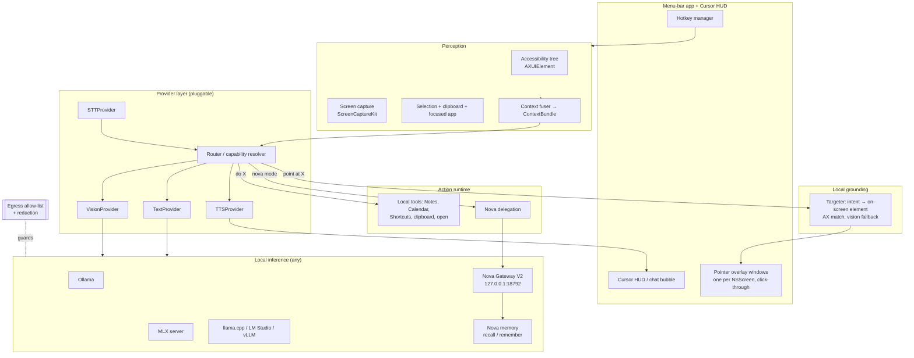

# Lodestar — a local-only, cursor-adjacent AI companion for macOS

*Working title. A privacy-respecting reimagining of "Clicky": an AI buddy that lives next to
your mouse pointer, sees your screen, hears you, talks back, and physically points at UI
elements — but with **zero cloud egress** and a **provider-agnostic** brain that runs on any
local inference engine, Nova included.*

---

## 1. Non-negotiables (the whole point)

1. **Local-only.** No data leaves the machine except to inference endpoints the user has
   explicitly configured, and those must be local (`127.0.0.1`) or on an allow-listed LAN host
   (e.g. the Nova gateway / Ollama box). Enforced in code by an egress allow-list, not a promise.
2. **Provider-agnostic.** The app has no built-in model. Text, vision, speech-to-text, and
   text-to-speech are each a swappable capability satisfied by a pluggable backend. Ollama,
   LM Studio, llama.cpp, vLLM, MLX, and **Nova Gateway** are all first-class.
3. **Nova-native.** "Nova mode" routes through the existing Nova Gateway so you inherit her
   persona, memory (recall + remember), and agent tooling for free.
4. **Native macOS.** Swift/SwiftUI menu-bar app. No Electron. Small, fast, notarized.
5. **Intelligence ≠ grounding.** The model emits intent in natural language; a *local* targeter
   turns intent into on-screen coordinates. Any model — even a 3B local one — can drive the UI.

---

## 2. Feature parity (and where we diverge)

| Clicky (cloud) | Lodestar (local) |
|---|---|
| Pops up at cursor on Ctrl+Opt | Same, global hotkey (configurable) |
| Sees your screen | ScreenCaptureKit region/display capture **+ Accessibility tree** |
| Listens (AssemblyAI) | Local STT: **WhisperKit** (CoreML) / whisper.cpp / MLX-Whisper |
| Talks (ElevenLabs) | Local TTS: AVSpeechSynthesizer (default) / Piper / F5-TTS |
| Reasoning (Claude) | **Any local model** via provider layer; Nova by default |
| Points at UI across monitors | AX-grounded pointer overlay, multi-display |
| "clicky agent" background tasks | Local tool runtime **or** delegate to Nova's agent |
| Closed, cloud | Open, offline, egress-allow-listed, notarized |

Deltas we add on purpose: **secure-field redaction**, a **privacy pause**, a visible **capture
indicator**, and **model returns intent, app resolves location** (portability + safety).

---

## 3. Architecture



Everything above `BACKENDS` is the app; `BACKENDS` are external local processes the app talks to
over HTTP on loopback/LAN. The `SEC` guard sits on every outbound request.

---

## 4. Provider layer — the core of "any engine including Nova"

Four narrow capabilities, each independently swappable. A backend advertises which it satisfies.

```swift
enum Capability { case text, vision, tools, streaming }

protocol InferenceProvider: Sendable {
    var id: String { get }
    var capabilities: Set<Capability> { get }
    func chat(_ req: ChatRequest) -> AsyncThrowingStream<ChatChunk, Error>
}

struct ChatRequest {
    var messages: [Message]          // Message may carry text + PNG attachments (vision)
    var tools: [ToolSpec]            // empty unless provider has .tools
    var model: String?
    var temperature: Double?
    var stream: Bool
}
```

Three concrete adapters cover essentially the whole local ecosystem:

- **`OpenAICompatibleProvider`** — one adapter, many engines. Ollama (`/v1`), LM Studio,
  llama.cpp `server`, vLLM, and `mlx_lm.server` all speak the OpenAI Chat Completions shape,
  including base64 `image_url` for vision. Config is just `base_url` + model names.
- **`NovaGatewayProvider`** — POSTs to the Nova Gateway (`127.0.0.1:18792`) so answers come
  back with Nova's persona and can be memory-augmented. Optionally calls the memory server's
  recall before the prompt and `remember` after, tagging interactions `source="lodestar"`.
- **`NativeMLXProvider`** *(optional)* — in-process MLX via `mlx-swift` for a zero-network,
  same-app model, for when you don't want to run a server at all.

Separate, equally pluggable speech protocols:

```swift
protocol STTProvider { func transcribe(_ audio: AudioBuffer) async throws -> String }
protocol TTSProvider { func speak(_ text: String) async throws }   // streamed to speakers
```

- STT engines: **WhisperKit** (CoreML, native Swift, on-device — the natural default),
  whisper.cpp (Metal), or MLX-Whisper.
- TTS engines: **AVSpeechSynthesizer** (built-in, zero-dep default), **Piper** (ONNX, better
  voices), or **F5-TTS** (you already run it in the Nova stack — reuse `f5_tts`).

**Routing.** The user maps intents → providers so cheap things stay fast and heavy things go
where the big model lives:

```
default = "nova"     # persona + memory
quick   = "mlx"      # tiny local model for selection Q&A, autocomplete
vision  = "ollama"   # llama3.2-vision / qwen2-vl for screenshots
stt     = "whisperkit"
tts     = "avspeech"
```

---

## 5. Perception — how it "sees"

Two tiers, cheapest first. **AX before pixels** keeps it fast, precise, and often avoids a
vision-model call entirely.

1. **Accessibility tree (primary).** `AXUIElement` from the focused app: element roles, labels,
   values, and **frames** (`kAXPositionAttribute` / `kAXSizeAttribute`). This is structured,
   exact, and it's what makes pointing reliable. Requires the Accessibility TCC grant.
2. **Screen capture (when pixels matter).** `ScreenCaptureKit` (`SCScreenshotManager` for
   stills, `SCStream` if we ever want live) for the active display or a **region around the
   cursor**. Downscale before sending to a vision model (latency + tokens). Canvas apps
   (Figma, DaVinci, After Effects) where AX is thin → this is the fallback.
3. **Selection & focus.** Selected text via AX (`kAXSelectedTextAttribute`) or a clipboard peek;
   frontmost app + window title for context.

All of it fuses into a `ContextBundle { focusedApp, axSummary, screenshot?, selection?, cursor }`
that the router hands to the provider. The bundle is built in-memory and discarded after the turn.

---

## 6. Grounding & the pointer overlay — the trick that makes it portable

The model never gets screen coordinates and never returns them. It returns **intent**:

```json
{ "action": "point", "target": "the Export button", "say": "Top-right — click Export." }
```

A local **Targeter** resolves `"the Export button"` to a concrete rect:

1. Match against the AX tree by role + label/value (fuzzy). Cheap, exact when it hits.
2. Miss (canvas app)? Ask the **vision** provider to return a normalized bbox for the phrase,
   map it back to screen pixels. (Optional, only when AX fails.)

Then the **overlay** draws the pointer:

- One transparent `NSWindow` per `NSScreen` (or one spanning the union), `level` above normal
  windows, `backgroundColor = .clear`, `ignoresMouseEvents = true`,
  `collectionBehavior = [.canJoinAllSpaces, .stationary]`. Draw an animated arrow/halo at the
  target rect with a SwiftUI `Canvas` / `CAShapeLayer`.
- Multi-monitor is free because each screen owns its overlay and targets carry their `NSScreen`.

**Why this matters:** grounding is 100% local and provider-independent, so swapping Nova for a
3B Ollama model doesn't break pointing. The dumb model still points correctly.

---

## 7. Voice loop

- **Input:** push-to-talk on the hotkey (hold = record). `AVAudioEngine` taps the mic → buffer →
  `STTProvider`. Streaming partials to the HUD if the engine supports it.
- **Output:** responses stream token-by-token to the HUD bubble and, if voice is on, to the
  `TTSProvider`. Barge-in: a new hotkey press cancels in-flight TTS.
- Mic is only hot while the key is held; a menu-bar dot shows when audio is captured.

---

## 8. Interaction & UI

- **Menu-bar app** (LSUIElement, no dock icon) — status, provider picker, privacy pause,
  permissions, quit.
- **Cursor HUD** — a small bubble that appears next to the pointer on hotkey: text in/out,
  streaming answer, quick actions. Follows the cursor or pins.
- **Global hotkey** — `KeyboardShortcuts` (Sindre Sorhus) or a `CGEventTap`. Default Ctrl+Opt;
  a separate "privacy pause" chord.

---

## 9. Agent / action runtime

Quick Q&A and pointing go straight through the provider. "Do something" splits two ways:

- **Local tools** (allow-listed, each behind a capability toggle): Apple Notes (AppleScript),
  Calendar/Reminders (EventKit), **Shortcuts** (`shortcuts run …` — huge surface for free),
  clipboard, open URL/app, read files in whitelisted dirs. Driven by tool-calling models
  (Ollama tool support) or a local ReAct/JSON protocol parsed in-app for models without it.
- **Nova delegation.** "clicky agent, …" hands the task to the Nova Gateway, which already has
  agent routing, the scheduler, memory, and Slack/etc. Lodestar becomes a *face* for Nova at
  your cursor rather than reimplementing an agent. This is the recommended path for anything
  stateful or long-running.

---

## 10. Nova integration specifics

- **Provider:** `NovaGatewayProvider` → `POST http://127.0.0.1:18792` (gateway is the
  `net.digitalnoise.nova-gateway-v2` launchd service, health on :18792). Answers carry Nova's
  persona (`nova_voice.py`).
- **Memory:** optional recall from the memory server (`memory-server.digitalnoise.net:18790`)
  to prepend relevant context; `remember` after the turn with `source="lodestar"` so Nova
  learns from what you do at the cursor. (These hosts get explicitly added to the egress
  allow-list — they're your LAN, not the internet.)
- **Voice:** reuse the existing `f5_tts` path as the TTS provider so Lodestar *sounds* like Nova.

---

## 11. Security & privacy model (the part you'll care about)

- **Egress allow-list, enforced in code.** A single outbound HTTP chokepoint rejects any host
  not in the allow-list. Default: `127.0.0.1`, `::1`. User may add specific LAN hosts
  (gateway, Ollama, memory server). Everything else is dropped and logged. No exceptions, no
  analytics, no update-pinger.
- **Screen/audio are ephemeral.** Frames and audio buffers live in memory for the turn and are
  never written to disk or sent anywhere but the chosen local provider. Retention = none
  (configurable up, not down).
- **Secure-field redaction.** Before any screenshot leaves for a vision model, mask regions
  whose AX role is `AXSecureTextField` (password fields). Optionally refuse to capture at all
  while a known password manager is frontmost.
- **Visible capture indicator + privacy pause.** Menu-bar dot when capturing; a global chord
  hard-stops all capture/inference. Respect the OS purple screen-recording indicator.
- **Secrets in Keychain.** If any provider needs a token, it lives in the Keychain
  (`kSecClassGenericPassword`, `…ThisDeviceOnly`) — never argv, never a plist. (Same rule we
  just enforced across your repos.)
- **Sandbox reality.** Controlling other apps via Accessibility/AppleScript + screen capture is
  incompatible with the App Sandbox. Ship **non-sandboxed, Developer-ID notarized**, requesting
  only the TCC grants below. Call this out to users plainly.
- **Permissions (TCC):** Accessibility (control + read UI), Screen Recording, Microphone,
  Automation (per-app, for Notes/Calendar). All are explicit user grants; the app degrades
  gracefully if any is denied (e.g. no Accessibility → vision-only pointing).

---

## 12. Tech stack

- **Language/UI:** Swift 6, SwiftUI + AppKit bridge for the overlay/HUD windows.
- **Capture:** ScreenCaptureKit. **UI model:** Accessibility (AXUIElement).
- **Hotkey:** KeyboardShortcuts (SPM) or CGEventTap.
- **STT:** WhisperKit (SPM) default; whisper.cpp / MLX-Whisper optional.
- **TTS:** AVSpeechSynthesizer default; Piper / F5-TTS optional.
- **Inference:** HTTP to local OpenAI-compatible servers + Nova adapter; optional in-proc
  `mlx-swift`.
- **Deps kept minimal on purpose** — this should be a small, auditable binary.

---

## 13. Config (single TOML, human-editable)

```toml
[hotkey]        invoke = "ctrl+opt+space"   ; pause = "ctrl+opt+."

[providers.nova]  kind = "nova-gateway"  base_url = "http://127.0.0.1:18792"  use_memory = true
[providers.ollama] kind = "openai"  base_url = "http://127.0.0.1:11434/v1"  text = "llama3.1:8b"  vision = "llama3.2-vision:11b"
[providers.mlx]    kind = "openai"  base_url = "http://127.0.0.1:8080/v1"   text = "qwen2.5-7b"

[routing]  default = "nova"   quick = "mlx"   vision = "ollama"
[speech]   stt = "whisperkit"  stt_model = "large-v3-turbo"   tts = "avspeech"

[security]
egress_allowlist = ["127.0.0.1", "::1",
                    "memory-server.digitalnoise.net", "ollama.digitalnoise.net"]
redact_secure_fields = true
capture_retention = "none"

[tools]  notes = true  calendar = true  shortcuts = true  files = false
```

---

## 14. Build order (each milestone is demoable)

- **M0 — Skeleton.** Menu-bar app, hotkey, cursor HUD, config loader, one
  `OpenAICompatibleProvider` (Ollama), text-only. Demo: hotkey → ask about selected text.
- **M1 — Sight.** ScreenCaptureKit + AX context + a vision provider. Demo: "what's on my screen?"
- **M2 — Point.** Targeter (AX match) + overlay, single then multi-monitor. Demo: "where do I
  export this?" → arrow lands on the button.
- **M3 — Voice.** WhisperKit push-to-talk + AVSpeech out. Demo: fully spoken round-trip.
- **M4 — Nova.** `NovaGatewayProvider` + memory recall/remember + persona; "clicky agent"
  delegation. Demo: Nova answers in her voice, remembers the session.
- **M5 — Act & harden.** Local tool runtime (Notes/Calendar/Shortcuts), secure-field redaction,
  egress-allow-list enforcement, privacy pause, notarized release.

---

## 15. Open questions / risks

- **AX coverage in canvas apps** (Figma/DaVinci) is thin → pointing there leans on the vision
  fallback; grounding accuracy depends on the local VLM. Worth an early spike on M2.
- **Local vision latency.** 11B-class vision models on Apple Silicon are ~seconds/response;
  fine for "point at X," sluggish for rapid back-and-forth. Mitigate with AX-first + region
  capture + downscaling.
- **Tool-calling** varies by local model. Ship the ReAct/JSON fallback so tools work even on
  models without native function-calling.
- **Whose job is "point"?** Firmly the app's (local grounding), not the model's — keep that
  boundary or portability erodes.

---

## 16. Name

`Lodestar` (a star you navigate by) is the placeholder. Alternatives that fit the "points the
way, lives by your cursor, Nova-adjacent" vibe: **Beacon**, **Nudge**, **Waypoint**, **Halo**,
**Pathfinder**. Or keep it in the Nova family: **NovaPoint**.
